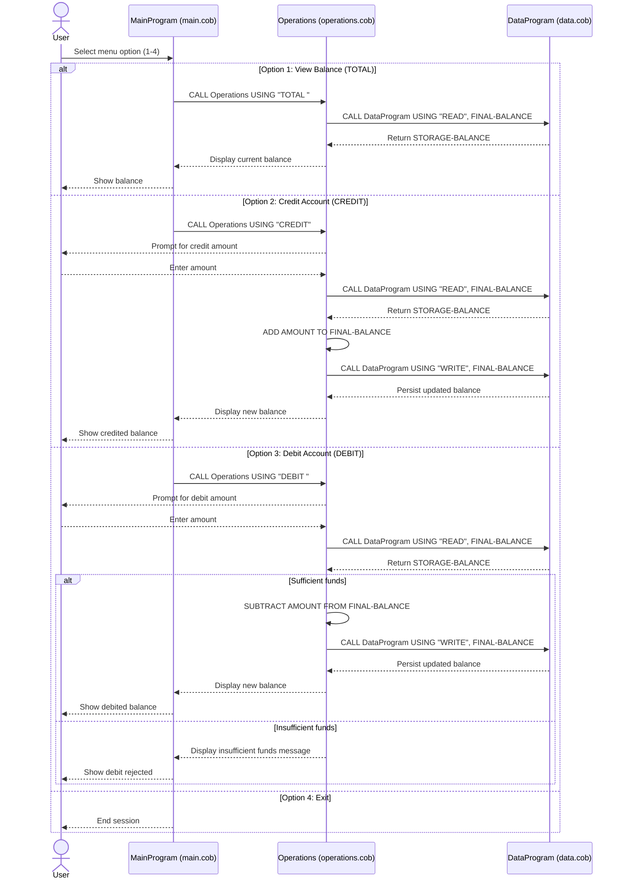

# Student Account COBOL Documentation

## Purpose

This document describes the COBOL programs that implement the student account management flow, including each file's role, key functions, and the business rules applied to account balances.

## COBOL File Responsibilities

### src/cobol/main.cob (PROGRAM-ID: MainProgram)
Role:
- Entry point and menu controller for the account system.
- Handles user interaction and routes requests to the operations layer.

Key functions:
- Displays menu options for balance inquiry, credit, debit, and exit.
- Accepts user choice in a loop until the user exits.
- Calls Operations with operation codes:
  - TOTAL  (balance inquiry)
  - CREDIT (credit account)
  - DEBIT  (debit account)
- Rejects invalid menu choices with an error message.

### src/cobol/operations.cob (PROGRAM-ID: Operations)
Role:
- Business logic layer for student account transactions.
- Performs transaction calculations and coordinates data access.

Key functions:
- Receives operation type from MainProgram.
- TOTAL:
  - Calls DataProgram with READ.
  - Displays current balance.
- CREDIT:
  - Prompts for amount.
  - Reads current balance, adds amount, writes updated balance.
  - Displays updated balance.
- DEBIT:
  - Prompts for amount.
  - Reads current balance.
  - Validates sufficient funds before subtracting.
  - Writes updated balance only if validation passes.
  - Displays an insufficient funds message when validation fails.

### src/cobol/data.cob (PROGRAM-ID: DataProgram)
Role:
- In-memory data service for account balance storage and retrieval.

Key functions:
- Stores account balance in WORKING-STORAGE (STORAGE-BALANCE).
- READ operation copies internal balance to caller.
- WRITE operation updates internal balance from caller.
- Initializes default balance to 1000.00.

## End-to-End Flow

1. MainProgram prompts for a menu selection.
2. MainProgram calls Operations with a 6-character operation code.
3. Operations reads or updates balance through DataProgram.
4. DataProgram returns balance data or stores updated value.
5. Control returns to MainProgram for the next action.

## Student Account Business Rules

1. Initial balance:
- The student account starts at 1000.00.

2. Balance inquiry:
- Balance must be retrieved using READ before display.

3. Credit processing:
- Entered credit amount is added to the current balance.
- Updated balance is persisted via WRITE.

4. Debit processing:
- Debit is allowed only when current balance is greater than or equal to requested debit amount.
- If funds are insufficient, no WRITE occurs and the balance remains unchanged.

5. Operation code format:
- Operation fields are fixed width (PIC X(6)).
- TOTAL and DEBIT are passed with trailing spaces to match 6 characters.

6. Data scope limitation:
- Balance is maintained in program memory, not a file or database.
- Balance persistence is limited to runtime/program lifecycle behavior.

## Notes for Future Modernization

- Add validation to block zero or negative transaction amounts.
- Support separate balances per student account ID.
- Replace in-memory storage with persistent storage (file, DB, or service).
- Standardize operation constants to reduce fixed-width string risks.

## Sequence Diagram (Data Flow)

